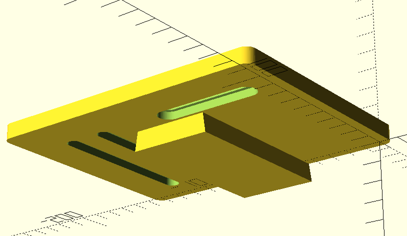
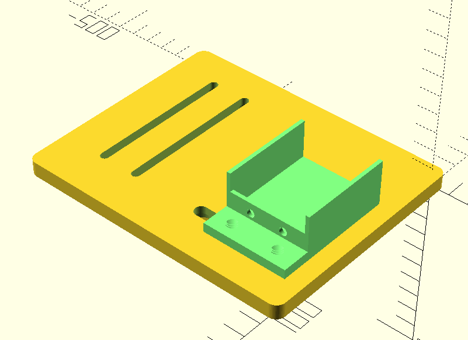
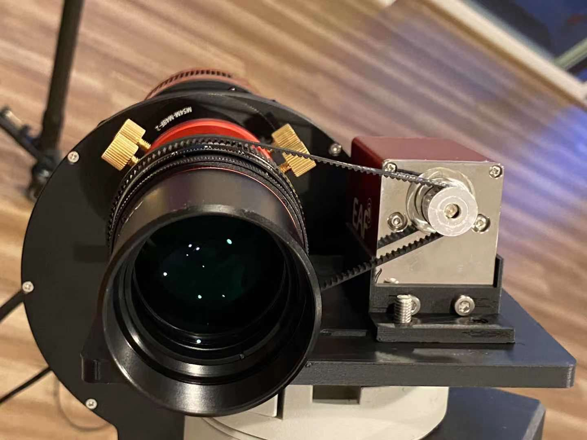
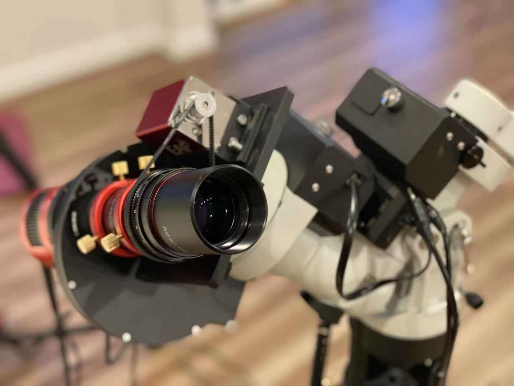
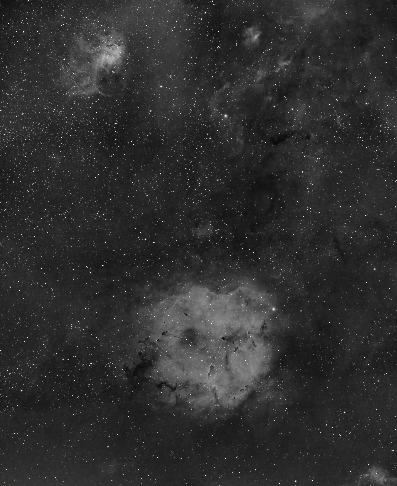

## 锐星FMA180自动对焦解决方案

最近买了一个锐星的FMA180打算拍广域。这个镜子因为口径特别小（40mm f/4.5，焦距180mm），所以没有配一般的对焦器，而是像镜头一样在镜身上有个对焦环。因为用的ZWO EAF默认只支持望远镜对焦器，所以买了传动皮带做了一个自动对焦的装置。分享一下。

其实思路非常简单，就是3D打印一个鸠尾板，然后打印一个装置把EAF用螺丝固定在鸠尾板上。然后用皮带把望远镜（或者其他镜头）的对焦环和EAF连接起来即可。设计出来的模型可以在github下载：https://github.com/grapeot/FMA180AutoFocus/。模型如下图：

有几个需要注意的地方：
1. 皮带用的就是GT2皮带，3D打印机上很多也是这种。配套的滑轮（不确定是不是应该叫滑轮？pulley）是5mm的。皮带长度我用的是280mm，这样配套FMA180和鸠尾板的长度正好适配。如果用了其他镜头或者皮带需要重新调整参数。
2. 因为对焦环是凸出来的，所以如果直接安装的话会卡死鸠尾板，导致皮带装不进去。所以我们还需要在上面放四个垫圈。垫圈也是可以打印的，见washer.stl。另外两个STL文件一个是鸠尾板一个是EAF支架。我用的是OpenSCAD开发的，源文件也放进去了。
3. 装配非常简单。基本上把螺丝拧上就好了。固定望远镜用的是随镜附赠的M4螺丝，注意拧的时候要套上垫圈。固定EAF用的是EAF带的M4螺丝（螺距和FMA的M4还不一样）。把EAF支架固定在鸠尾板上用的是M6螺丝，需要另外购买。建议的装配顺序是，先装EAF支架，不要拧死螺丝。然后装FMA主镜，也不要拧死螺丝。然后安装皮带，调整FMA和EAF的位置，左右调EAF，前后调FMA，使得对焦环和EAF平齐，皮带有一定张力。拧紧螺丝。注意EAF支架的螺丝不要太紧，否则可能会破坏打印出来的螺纹。
4. 这个对焦环有个坑是对焦的时候自己会前后跑。所以我的设计是有缺陷的。好在EAF自动对焦的行程不长，只要事先大致拧到合焦的位置（刻度大约是10附近），然后调整FMA的前后位置即可。实测这样是可以可靠自动对焦的。

最终的成品类似这样：

开光拍了个Ha通道2x4的马赛克，总共3小时曝光，效果如图：

